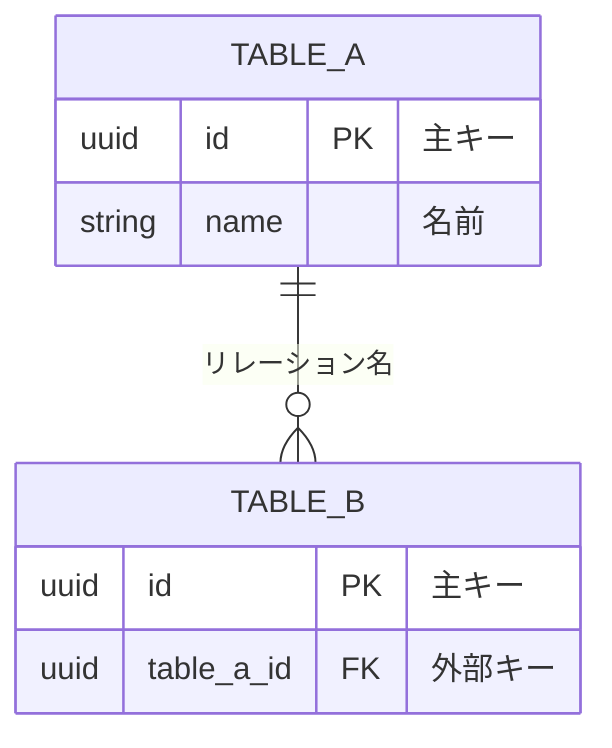

# ダイアグラム

このディレクトリには、配当管理アプリケーションの各種ダイアグラムが含まれています。

## 📋 ファイル一覧

| ファイル                             | 説明                       | 形式    |
| ------------------------------------ | -------------------------- | ------- |
| [database-erd.md](./database-erd.md) | データベースER図（完全版） | Mermaid |

---

## 🔍 ER図の閲覧方法

### 方法1: GitHub上で閲覧

GitHubにプッシュすると、Mermaid図が自動的にレンダリングされます。

- リポジトリ上で `database-erd.md` を開くだけでOK

### 方法2: VS Codeで閲覧

VS Codeの拡張機能を使って、ローカルで閲覧できます。

1. **拡張機能のインストール**

   ```
   Markdown Preview Mermaid Support
   ```

   または

   ```
   Mermaid Markdown Syntax Highlighting
   ```

2. **プレビュー表示**
   - `database-erd.md` を開く
   - `Cmd+Shift+V` (Mac) または `Ctrl+Shift+V` (Windows) でプレビュー表示

### 方法3: Mermaid Live Editorで閲覧

オンラインエディタで閲覧・編集できます。

1. [Mermaid Live Editor](https://mermaid.live/) にアクセス
2. `database-erd.md` 内の Mermaid コードをコピー&ペースト
3. リアルタイムでプレビューが表示されます

### 方法4: CLIツールでPNG/SVG出力

Mermaid CLIを使って、画像ファイルとして出力できます。

```bash
# Mermaid CLIをインストール
npm install -g @mermaid-js/mermaid-cli

# PNG形式で出力
mmdc -i docs/diagrams/database-erd.md -o docs/diagrams/database-erd.png

# SVG形式で出力
mmdc -i docs/diagrams/database-erd.md -o docs/diagrams/database-erd.svg
```

---

## 📊 含まれる図の種類

### 1. 完全版ER図

- 全テーブルの詳細な定義
- すべてのカラムとデータ型
- リレーションシップの明示

### 2. 簡易版ER図

- テーブル間のリレーションシップに焦点
- カテゴリ別に色分け
- 視覚的にわかりやすい構造

### 3. データフロー図

- ユーザーアクションに基づくデータの流れ
- シーケンス図形式

### 4. Phase 2以降の拡張図

- 将来追加予定のテーブル構造

---

## 🔄 図の更新

データベーススキーマを変更した場合は、必ずこのER図も更新してください。

### 更新手順

1. `database-erd.md` を編集
2. 変更をコミット
3. 関連ドキュメント（`database.md`, `setup_scratch.md`）も同期

### 更新時のチェックリスト

- [ ] 新しいテーブルを追加
- [ ] リレーションシップを追加
- [ ] カラムの追加・変更を反映
- [ ] インデックス情報を更新
- [ ] RLSポリシー情報を更新
- [ ] コメント・説明文を追加

---

## 📝 Mermaid構文リファレンス

### ER図の基本構文



### リレーションシップの記号

| 記号         | 意味                     |
| ------------ | ------------------------ |
| `\|o--o\|`   | ゼロまたは1対ゼロまたは1 |
| `\|\|--o{`   | 1対ゼロ以上              |
| `}o--o{`     | ゼロ以上対ゼロ以上       |
| `\|\|--\|\|` | 1対1                     |

---

## 🛠️ トラブルシューティング

### Mermaid図が表示されない

- GitHubでは自動レンダリングされます
- VS Codeでは拡張機能が必要です
- ブラウザのキャッシュをクリアしてみてください

### 図が複雑すぎて見づらい

- 簡易版ER図を参照してください
- Mermaid Live Editorでズーム機能を使用してください

### エラーが表示される

- Mermaid構文が正しいか確認してください
- カンマやセミコロンの位置を確認してください
- 日本語コメントは `"` で囲んでください

---

## 📚 参考リンク

- [Mermaid 公式ドキュメント](https://mermaid.js.org/)
- [Mermaid ER図 構文](https://mermaid.js.org/syntax/entityRelationshipDiagram.html)
- [Mermaid Live Editor](https://mermaid.live/)
- [GitHub Mermaidサポート](https://github.blog/2022-02-14-include-diagrams-markdown-files-mermaid/)
