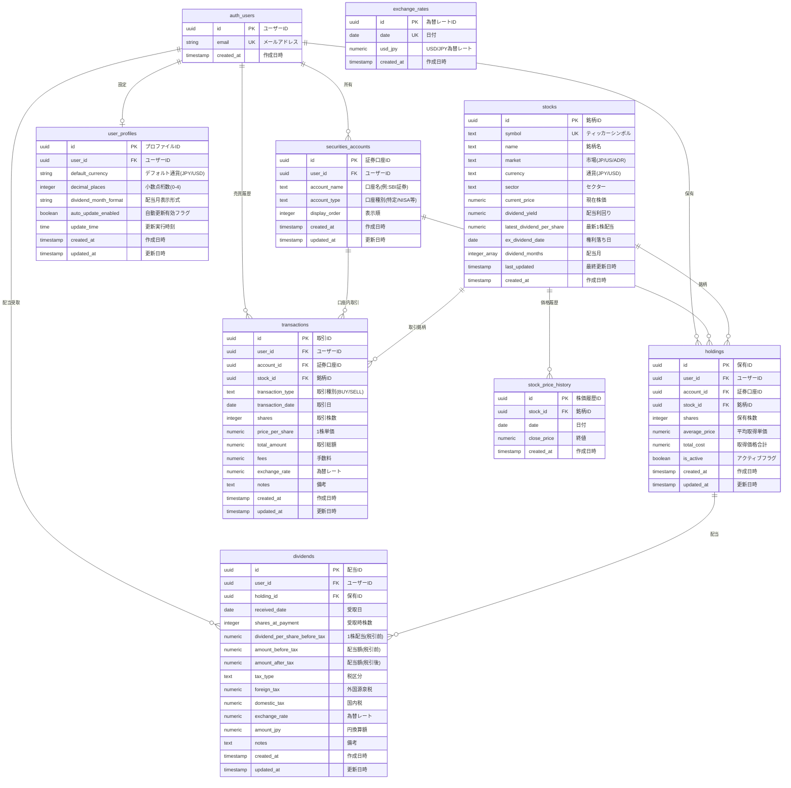
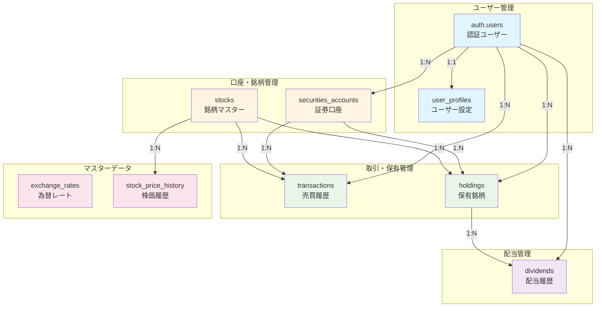
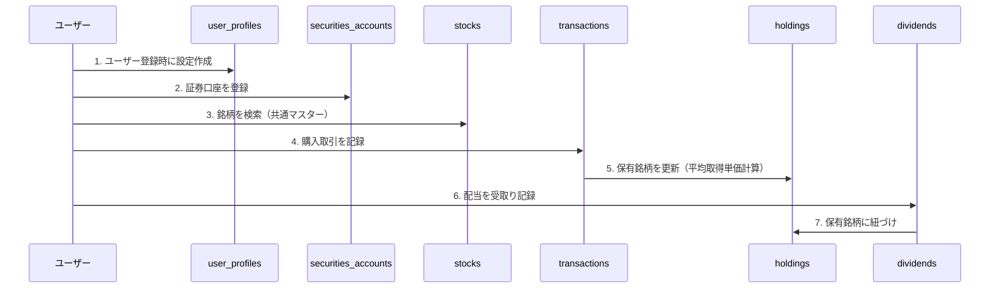
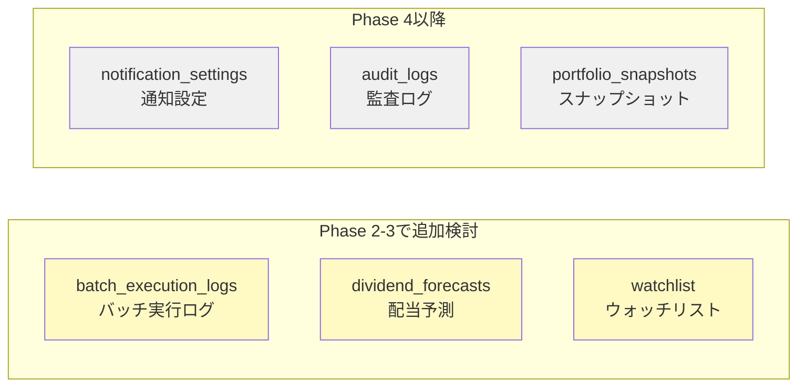

# データベースER図

配当管理アプリケーションのデータベース構造を視覚化したER図です。

## Phase 1 完全版ER図



---

## 簡易版ER図（リレーションシップ重視）



---

## テーブルカテゴリ別の説明

### 🔐 認証・ユーザー管理

| テーブル      | 目的         | 備考                       |
| ------------- | ------------ | -------------------------- |
| auth.users    | Supabase認証 | Supabase Authが管理        |
| user_profiles | ユーザー設定 | 表示設定、自動更新設定など |

### 💼 証券口座・銘柄マスター

| テーブル            | 目的         | 備考              |
| ------------------- | ------------ | ----------------- |
| securities_accounts | 証券口座管理 | SBI、楽天証券など |
| stocks              | 銘柄マスター | 全ユーザー共通    |

### 📊 取引・保有データ

| テーブル     | 目的     | 備考                   |
| ------------ | -------- | ---------------------- |
| transactions | 売買履歴 | 平均取得単価計算の基盤 |
| holdings     | 保有銘柄 | 現在の保有状況         |
| dividends    | 配当履歴 | 受取配当の記録         |

### 🌐 マスターデータ

| テーブル            | 目的       | 備考                 |
| ------------------- | ---------- | -------------------- |
| exchange_rates      | 為替レート | 1日1回更新           |
| stock_price_history | 株価履歴   | 四半期別資産額計算用 |

---

## 主要なリレーションシップ

### 1. ユーザー → 証券口座 → 保有銘柄

```
auth.users (1) ---> (N) securities_accounts (1) ---> (N) holdings
```

- 1ユーザーは複数の証券口座を持つ
- 1証券口座は複数の保有銘柄を持つ

### 2. 保有銘柄 → 配当履歴

```
holdings (1) ---> (N) dividends
```

- 1つの保有銘柄は複数の配当履歴を持つ

### 3. 銘柄マスター → 保有銘柄

```
stocks (1) ---> (N) holdings
```

- 1つの銘柄は複数のユーザーに保有される（全ユーザー共通）

### 4. 証券口座 → 売買履歴

```
securities_accounts (1) ---> (N) transactions
stocks (1) ---> (N) transactions
```

- 売買履歴は口座と銘柄の両方に紐づく

---

## データフロー



---

## インデックス戦略

### 複合インデックス

```sql
-- よく使われる検索パターンに対応
CREATE INDEX idx_holdings_active ON holdings(user_id, is_active);
CREATE INDEX idx_transactions_date ON transactions(transaction_date DESC);
CREATE INDEX idx_dividends_received_date ON dividends(received_date DESC);
```

### 外部キーインデックス

```sql
-- JOIN性能の向上
CREATE INDEX idx_holdings_user_id ON holdings(user_id);
CREATE INDEX idx_holdings_account_id ON holdings(account_id);
CREATE INDEX idx_holdings_stock_id ON holdings(stock_id);
CREATE INDEX idx_transactions_user_id ON transactions(user_id);
CREATE INDEX idx_transactions_account_id ON transactions(account_id);
CREATE INDEX idx_dividends_holding_id ON dividends(holding_id);
```

---

## RLS（Row Level Security）適用状況

| テーブル            | RLSポリシー         | 説明                           |
| ------------------- | ------------------- | ------------------------------ |
| user_profiles       | ✅ ユーザー自身のみ | 自分の設定のみアクセス可       |
| securities_accounts | ✅ ユーザー自身のみ | 自分の口座のみアクセス可       |
| holdings            | ✅ ユーザー自身のみ | 自分の保有銘柄のみアクセス可   |
| transactions        | ✅ ユーザー自身のみ | 自分の取引履歴のみアクセス可   |
| dividends           | ✅ ユーザー自身のみ | 自分の配当履歴のみアクセス可   |
| stocks              | ✅ 認証ユーザー全員 | 全ユーザー共通（読み取りのみ） |
| exchange_rates      | ✅ 認証ユーザー全員 | 全ユーザー共通（読み取りのみ） |
| stock_price_history | ✅ 認証ユーザー全員 | 全ユーザー共通（読み取りのみ） |

---

## 制約（Constraints）

### UNIQUE制約

```sql
-- 重複防止
holdings: UNIQUE(account_id, stock_id)  -- 同一口座で同一銘柄は1レコードのみ
exchange_rates: UNIQUE(date)            -- 1日1レートのみ
stock_price_history: UNIQUE(stock_id, date)  -- 1銘柄1日1価格のみ
```

### CHECK制約

```sql
-- データ整合性
holdings: CHECK (shares > 0)
holdings: CHECK (average_price > 0)
dividends: CHECK (amount_after_tax > 0)
transactions: CHECK (shares > 0)
transactions: CHECK (price_per_share > 0)
```

### 外部キー制約

```sql
-- 参照整合性（ON DELETE CASCADE）
holdings.user_id → auth.users(id)
holdings.account_id → securities_accounts(id)
holdings.stock_id → stocks(id)
dividends.holding_id → holdings(id)
transactions.account_id → securities_accounts(id)
```

---

## トリガー

### updated_at自動更新

以下のテーブルで`updated_at`カラムが自動更新されます：

- ✅ securities_accounts
- ✅ holdings
- ✅ dividends
- ✅ user_profiles
- ✅ transactions

```sql
CREATE TRIGGER update_{table_name}_updated_at
  BEFORE UPDATE ON {table_name}
  FOR EACH ROW
  EXECUTE FUNCTION update_updated_at_column();
```

---

## Phase 2以降の拡張予定

将来追加を検討しているテーブル：



---

## 参考資料

- [database.md](../initial-docs/database.md) - 詳細なテーブル定義
- [setup_scratch.md](../initial-docs/setup_scratch.md) - セットアップ手順
- [Supabase RLS ドキュメント](https://supabase.com/docs/guides/auth/row-level-security)
- [Mermaid ER図 構文](https://mermaid.js.org/syntax/entityRelationshipDiagram.html)
